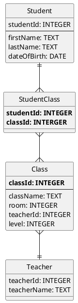

```plantuml
@startuml
' config
hide circle

entity "Student" {
    studentId: INTEGER
    --
    firstName: TEXT
    lastName: TEXT
    dateOfBirth: DATE
}

entity "StudentClass" {
    <b>studentId: INTEGER
    <b>classId: INTERGER
}

entity "Class" {
    <b>classId: INTEGER
    --
    className: TEXT
    room: INTEGER
    teacherId: INTEGER
    level: INTEGER
}

entity "Teacher" {
   teacherId: INTEGER
   teacherName: TEXT
}

StudentClass }--{ Class
Student ||--{ StudentClass
Class }--|| Teacher


@enduml
```